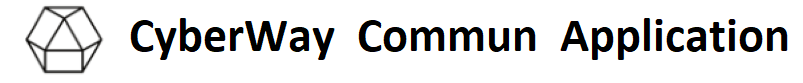

*****  

# Welcome to the CyberWay Commun Application source code repository!

The Commun Application is a platform for creating self-managed communities. Despite the fact that similar platforms already exist in networks, the commun platform in CyberWay has a number of original solutions: 

* The community does not have governance. Instead, an elective system of leaders is implemented that operates according to the principles of liquid democracy.
* Monetization implemented by default. All community members are rewarded, including:
  * message authors - for published content;
  * curators - for the ranking (voting) of published content;
  * leaders - for fulfilling their duties stipulated in the rules of the community.
* The rules by which a community operates are public, but may vary from community to community.

Number of communities is not limited. In the future, the platform’s capabilities will be expanded, which will allow users to create new types of communities, such as:
* Private communities in which membership is approved by a leader.
* Paid communities working on a subscription model and/or entry fees.
* Business communities owned by a company with a specific owner and leaders appointed by this owner. Content in such communities is created only by users who have permission to it. In such communities, all profits are distributed between members in accordance with the settings specified by the owner.

## Commun Contracts Description
* [point](https://doxygen.cyberway.io/group__point.html)
* [emit](https://doxygen.cyberway.io/group__emission.html)
* [ctrl](https://doxygen.cyberway.io/group__control.html)
* [list](https://doxygen.cyberway.io/group__list.html)
* [gallery](https://doxygen.cyberway.io/group__gallery.html)
* [publication](https://doxygen.cyberway.io/group__publish.html)
* [social](https://doxygen.cyberway.io/group__social.html)
